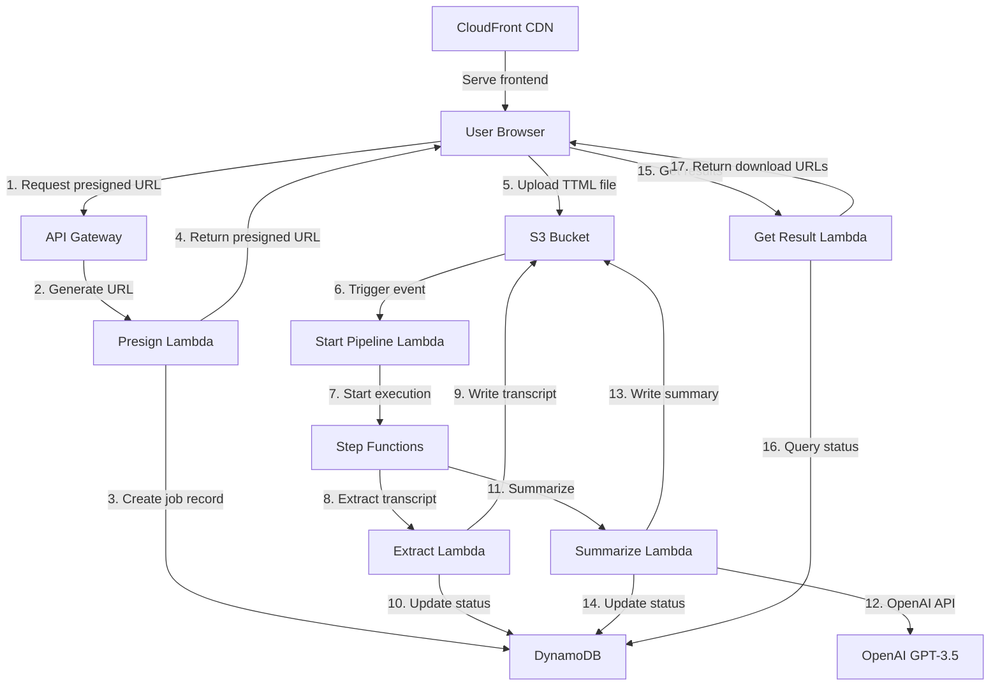

# Podcast Transcript Extractor and Summarizer

A cloud-native serverless application that extracts transcripts from Apple Podcasts TTML files and generates AI-powered summaries using OpenAI GPT models.

## Live Application

**Access the app here:** [https://d35sg48h6p3ej1.cloudfront.net](https://d35sg48h6p3ej1.cloudfront.net)

Simply upload a TTML file and receive an AI-generated summary within seconds. No installation required.

## Features

- **Serverless Architecture**: Built on AWS Lambda, S3, and Step Functions for infinite scalability
- **AI-Powered Summaries**: OpenAI GPT-3.5-turbo generates concise podcast summaries
- **TTML Transcript Extraction**: Parses Apple Podcasts TTML files with optional timestamp inclusion
- **Global CDN**: CloudFront distribution for fast access worldwide
- **Event-Driven Processing**: Automatic pipeline triggered by file uploads
- **Job Tracking**: DynamoDB-backed status monitoring for all processing jobs
- **Direct S3 Uploads**: Presigned URLs for secure, direct-to-S3 file transfers
- **Rate Limiting**: Built-in exponential backoff for OpenAI API calls
- **Automatic Cleanup**: S3 lifecycle policies manage storage costs

## Architecture

### Cloud Infrastructure (Production)


```mermaid
graph TD
    A[User Browser] -->|1. Request presigned URL| B[API Gateway]
    B -->|2. Generate URL| C[Presign Lambda]
    C -->|3. Create job record| D[DynamoDB]
    C -->|4. Return presigned URL| A
    A -->|5. Upload TTML file| E[S3 Bucket]
    E -->|6. Trigger event| F[Start Pipeline Lambda]
    F -->|7. Start execution| G[Step Functions]
    G -->|8. Extract transcript| H[Extract Lambda]
    H -->|9. Write transcript| E
    H -->|10. Update status| D
    G -->|11. Summarize| I[Summarize Lambda]
    I -->|12. OpenAI API| J[OpenAI GPT-3.5]
    I -->|13. Write summary| E
    I -->|14. Update status| D
    A -->|15. Get results| K[Get Result Lambda]
    K -->|16. Query status| D
    K -->|17. Return download URLs| A
    L[CloudFront CDN] -->|Serve frontend| A
```

**Technology Stack:**
- **Frontend**: Static HTML/JavaScript hosted on S3 + CloudFront
- **API**: AWS API Gateway + Lambda functions
- **Compute**: AWS Lambda (Python 3.12)
- **Storage**: Amazon S3 with lifecycle policies
- **Orchestration**: AWS Step Functions
- **Database**: Amazon DynamoDB (pay-per-request)
- **Secrets**: AWS Secrets Manager
- **Infrastructure**: AWS CDK (Python)
- **AI**: OpenAI GPT-3.5-turbo API

### Key AWS Resources

- **S3 Bucket**: Stores uploads, transcripts, and summaries
- **Lambda Functions**: 5 functions (presign, start_pipeline, extract, summarize, get_result)
- **Step Functions**: Orchestrates extract → summarize workflow
- **DynamoDB Table**: Tracks job status and metadata
- **API Gateway**: RESTful API endpoints
- **CloudFront**: CDN distribution for frontend
- **Secrets Manager**: Secures OpenAI API key

## Quick Start

### For Users

1. Go to [https://d35sg48h6p3ej1.cloudfront.net](https://d35sg48h6p3ej1.cloudfront.net)
2. Click "Choose File" and select a TTML file
3. Optionally enable timestamp inclusion
4. Click "Upload and Process"
5. Wait for processing (typically 30-60 seconds)
6. Download transcript and summary when ready

### For AWS Administrators

See **[DEPLOYMENT_GUIDE.md](./DEPLOYMENT_GUIDE.md)** for complete deployment instructions.

Quick deploy:
```bash
cd aws-cloud/podcast_stack
source .venv/bin/activate
cdk deploy PodcastStackStack-prod
```

## API Endpoints

Base URL: `https://g5oco2erb4.execute-api.us-east-1.amazonaws.com/prod/`

### 1. Get Presigned Upload URL
```bash
POST /presign
Content-Type: application/json

{
  "filename": "episode.ttml"
}
```

Response:
```json
{
  "uploadUrl": "https://s3.amazonaws.com/...",
  "jobId": "uuid-v4"
}
```

### 2. Get Job Results
```bash
GET /result?jobId={jobId}
```

Response:
```json
{
  "status": "completed",
  "transcriptUrl": "https://s3.amazonaws.com/...",
  "summaryUrl": "https://s3.amazonaws.com/..."
}
```

## TTML File Format

The application processes TTML (Timed Text Markup Language) files from Apple Podcasts. These XML files contain timestamped transcript data.

**Where to find TTML files (macOS):**
- Apple Podcasts cache: `~/Library/Group Containers/243LU875E5.groups.com.apple.podcasts/Library/Cache/Assets/TTML`
- Requires downloading podcast episodes in Apple Podcasts app first

**File structure:**
```xml
<?xml version="1.0" encoding="UTF-8"?>
<tt xmlns="http://www.w3.org/ns/ttml">
  <body>
    <div>
      <p begin="00:00:01.000">
        <span>Transcript text here...</span>
      </p>
    </div>
  </body>
</tt>
```

## Processing Pipeline

1. **Upload**: User uploads TTML file via web UI
2. **Presign**: API Gateway requests presigned S3 URL
3. **Direct Upload**: Browser uploads directly to S3
4. **Trigger**: S3 event notification triggers start_pipeline Lambda
5. **Orchestration**: Step Functions starts workflow
6. **Extract**: Extract Lambda parses TTML XML, extracts text and timestamps
7. **Chunk**: Transcript chunked into 4000-character blocks
8. **Summarize**: Summarize Lambda calls OpenAI API with rate limiting
9. **Store**: Results saved to S3 (transcripts/ and summaries/ prefixes)
10. **Track**: DynamoDB updated with status and URLs
11. **Retrieve**: User polls get_result endpoint for completion

## Cost Optimization

### S3 Lifecycle Policies
- **Uploads**: Deleted after 30 days
- **Transcripts**: Deleted after 90 days
- **Summaries**: Deleted after 180 days

### Lambda Optimization
- Right-sized memory allocation (256MB - 1024MB)
- Minimal cold start dependencies
- Efficient error handling and retries

### DynamoDB
- Pay-per-request billing (no idle costs)
- No provisioned capacity

## Local Development (Archived)

The original Flask-based local application has been archived to `archive/flask-app/`.

**Why archived:**
- Requires macOS + Apple Podcasts app
- Single-threaded, no scalability
- Manual file monitoring
- No global distribution

**For local testing**, see `archive/flask-app/README.md` for setup instructions.

## Repository Structure

```
.
├── README.md                      # This file
├── DEPLOYMENT_GUIDE.md            # AWS deployment instructions
├── MIGRATION_COMPLETE.md          # Migration summary
├── CLAUDE.md                      # AI assistant context
├── index.html                     # CloudFront-hosted frontend
├── aws-test.html                  # Testing utility
├── env.example                    # Environment variable template
├── requirements.txt               # AWS CLI/CDK requirements (minimal)
├── .gitignore                     # Git ignore rules
├── archive/                       # Archived Flask application
│   └── flask-app/                 # Original local implementation
│       ├── README.md              # Flask app documentation
│       ├── app.py                 # Main Flask app
│       ├── monitor_ttml.py        # File watcher
│       ├── viewer.py              # Transcript viewer
│       ├── clean_ttml.py          # TTML utility
│       ├── templates/             # HTML templates
│       ├── tests/                 # Test scripts
│       └── flask-requirements.txt # Flask dependencies
└── aws-cloud/                     # AWS serverless implementation
    ├── DEPLOYMENT.md              # Detailed deployment guide
    ├── MIGRATION_SUMMARY.md       # Architecture comparison
    └── podcast_stack/             # CDK project
        ├── app.py                 # CDK entry point
        ├── requirements.txt       # CDK dependencies
        ├── lambda_functions/      # Lambda source code
        │   ├── presign/
        │   ├── start_pipeline/
        │   ├── extract_transcript/
        │   ├── summarize_transcript/
        │   └── get_result/
        └── podcast_stack/         # CDK stack definitions
            └── podcast_stack_stack.py
```

## Technical Details

### TTML Parsing
- XML namespace: `http://www.w3.org/ns/ttml`
- Extracts text from `<p>` and `<span>` elements
- Optional timestamp extraction from `begin` attribute
- Format: HH:MM:SS

### OpenAI Rate Limiting
- 4000-character chunks
- 3-second delays between requests
- Exponential backoff: `min(60, 2^retry_count)` seconds
- Maximum 8 retries per chunk
- Fallback placeholder on exhaustion

### Security
- IAM roles with least-privilege principles
- Presigned URLs for secure S3 access
- Secrets Manager for API key storage
- CORS enabled for browser uploads
- No public S3 bucket access

## Monitoring

### CloudWatch Logs
All Lambda functions log to CloudWatch Logs:
- `/aws/lambda/PodcastStack-prod-presign`
- `/aws/lambda/PodcastStack-prod-start-pipeline`
- `/aws/lambda/PodcastStack-prod-extract-transcript`
- `/aws/lambda/PodcastStack-prod-summarize-transcript`
- `/aws/lambda/PodcastStack-prod-get-result`

### DynamoDB Table
View job status:
- Table name: `PodcastStackStack-prod-jobs`
- Partition key: `jobId`
- Attributes: status, filename, transcriptKey, summaryKey, timestamps

### Step Functions
Monitor workflow executions:
- State machine: `PodcastStackStack-prod-TranscriptPipeline`
- View execution history in AWS console

## Troubleshooting

### Upload fails
- Check file is valid TTML format
- Verify file size < 10MB
- Check browser console for CORS errors

### Processing stuck
- Check Step Functions execution in AWS console
- Review Lambda CloudWatch logs
- Verify OpenAI API key in Secrets Manager

### No summary generated
- Check OpenAI API rate limits
- Review summarize Lambda logs
- Verify sufficient Lambda timeout (15 minutes)

## Contributing

This project uses AWS CDK for infrastructure as code. To contribute:

1. Fork the repository
2. Create a feature branch
3. Make changes to CDK stack or Lambda functions
4. Test locally with `cdk synth`
5. Submit pull request

## Migration History

- **October 2025**: Initial Flask application created
- **November 2025**: Migrated to AWS serverless architecture
- **November 15, 2025**: Flask app archived, cloud-only deployment

See `MIGRATION_COMPLETE.md` for detailed migration notes.

## License

This project is licensed under the MIT License.

## Support

For issues or questions:
- Review `DEPLOYMENT_GUIDE.md` for setup help
- Check `aws-cloud/DEPLOYMENT.md` for AWS-specific guidance
- Review CloudWatch logs for runtime errors
- See `archive/flask-app/README.md` for legacy Flask documentation
