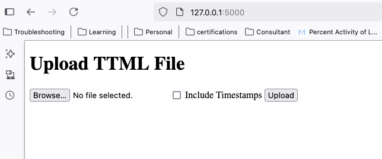
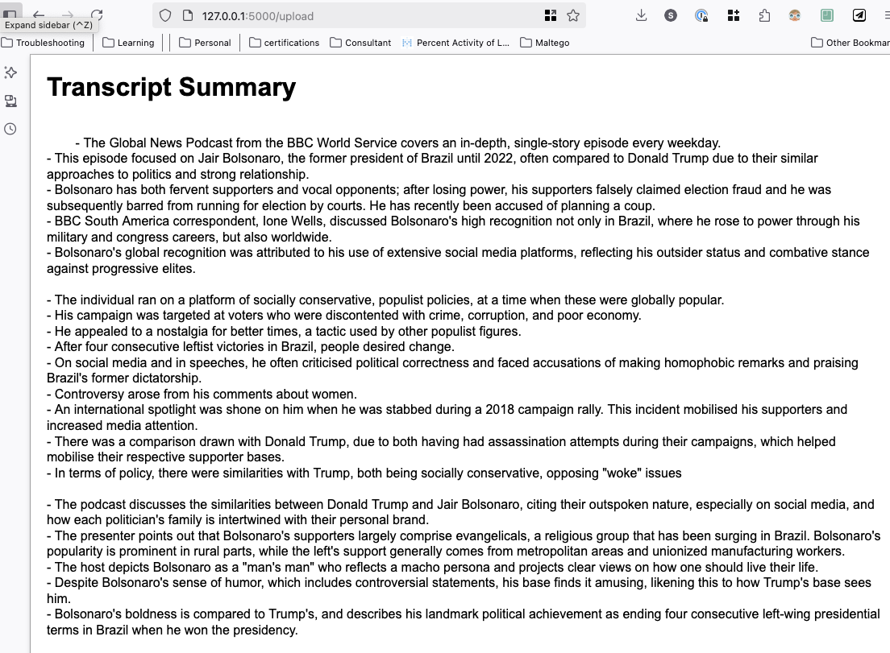
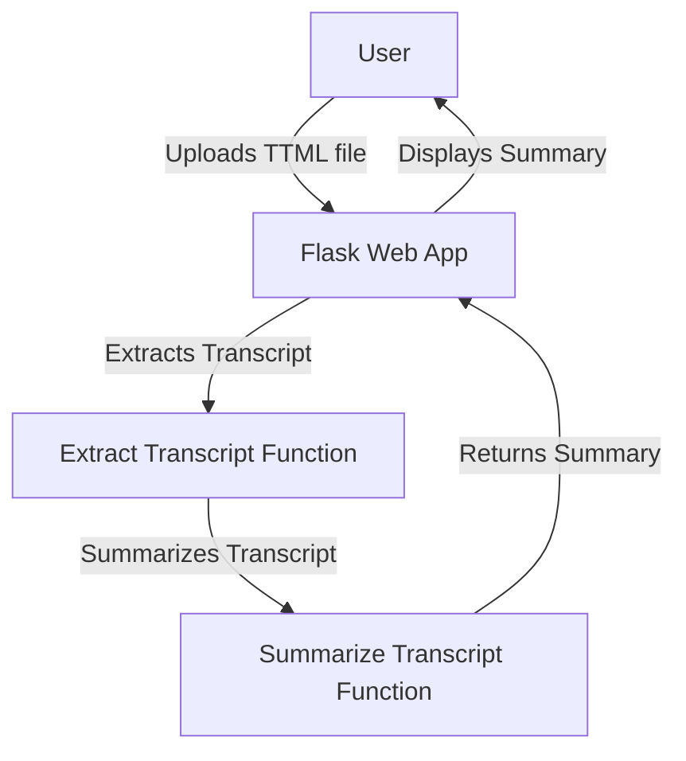
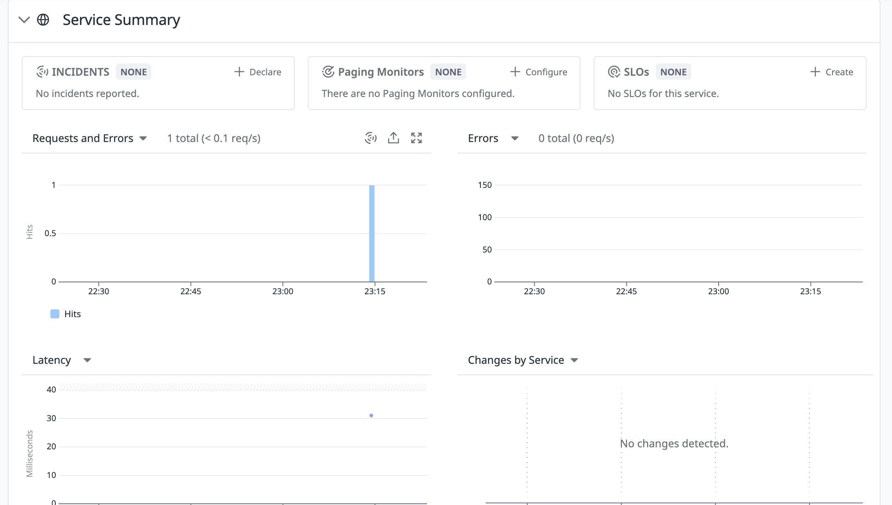
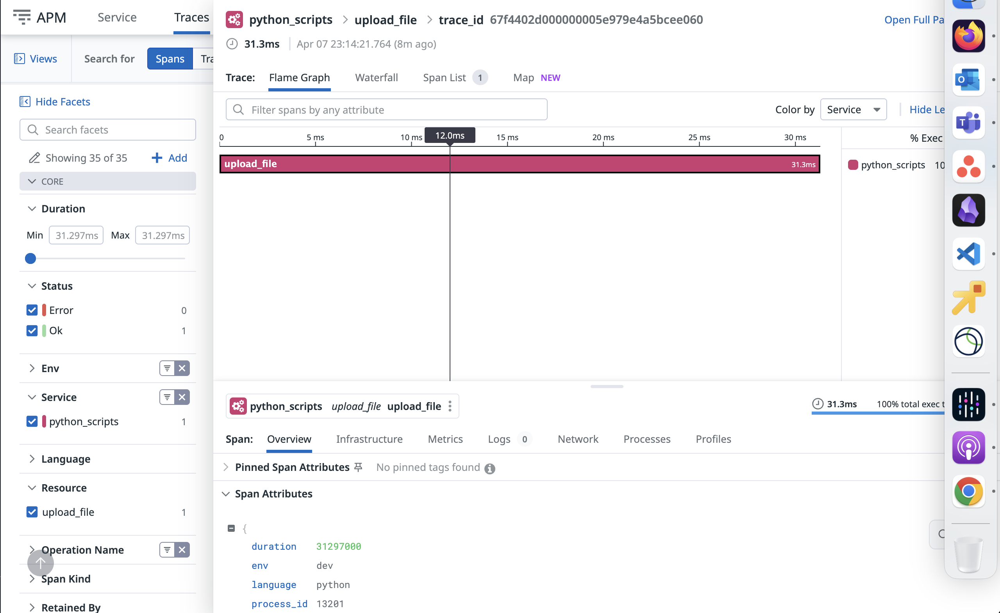
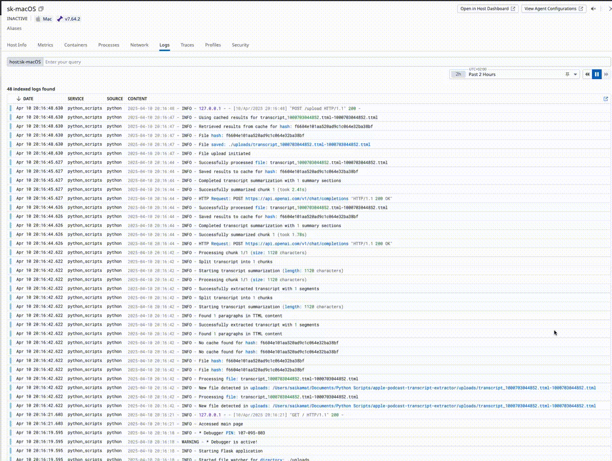

# Podcast Transcript Extractor and Summarizer

This is a Flask web application that allows users to upload TTML files, extract transcripts, and summarize them using OpenAI's GPT-4 model.

## Limitations
- Apple Podcasts app running on an Apple Desktop/Macbook
- Manually download the specific podcast episode

## Installation

1. Clone the repository:
    ```sh
    git clone https://github.com/saikamat/podcast-transcript-extractor.git
    cd apple-podcast-transcript-extractor
    ```

2. Create a virtual environment and activate it:
    ```sh
    python3 -m venv venv
    source venv/bin/activate
    ```

3. Install the required packages:
    ```sh
    pip install -r requirements.txt
    ```

4. Create a `.env` file in the root directory and add your OpenAI API key:
    ```plaintext
    OPENAI_API_KEY=your_openai_api_key
    ```
## Datadog Integration
1. Install Datadog Agent
2. Configure the config file for Datadog Agent at 
   ```
   /etc/datadog-agent/datadog.yaml # Linux Users
   ~/.datadog/datadog.yaml # macOS Users
   ```
    ### Agent Configuration
    Here I have configured the Datadog Agent as per the following path:-
    `https://github.com/saikamat/datadog-apm/blob/main/datdog-working-config-process-env.yaml`

    ### Custom Log Configuration
    My stand-alone python app currently sends all the logs to `app.log`. I want these to be reflected in Datadog.
    Follow the steps given here which illustrate [how to make datadog listen to logs from custom log files](https://docs.datadoghq.com/agent/logs/?tab=tailfiles#custom-log-collection).

    Below steps are for MacOS configuration:-
    1. Open ~/.datadog-agent/conf.d
    2. Create a new folder named `python_scripts.d` since that is the name of my service: `mkdir python_scripts.d`
    3. In this `python_scripts.d` folder, create a new file named `conf.yaml` to define the log collection configuration.
    4. Add the following content to the `conf.yaml` file:
       ```
       logs:
         - type: file
           path: "/path/to/your/app.log"
           service: "python_scripts"
           source: "python"
       ```
    5. Restart the Datadog Agent to apply the changes:
        ```bash
        launchctl stop com.datadoghq.agent
        launchctl start com.datadoghq.agent
        ```
    6. Verify that logs are being sent to Datadog by checking the Datadog Log Explorer.

## Running the Application

1. Start the application:
    ```sh
    bash run.sh # for Linux/Mac OS
    run.bat # for Windows
    ```
2. Open your web browser and go to `http://127.0.0.1:5000/`.
3. Upload a TTML file from the `uploads` folder.

1. The application will extract the transcript, summarize it, and display the summary.

## Architecture Diagram


```mermaid
graph TD
    A[User] -->|Uploads TTML file| B[Flask Web App]
    B -->|Extracts Transcript| C[Extract Transcript Function]
    C -->|Summarizes Transcript| D[Summarize Transcript Function]
    D -->|Returns Summary| B
    B -->|Displays Summary| A
```
## File Structure
```
podcast-transcript-extractor/
├── app.py
├── requirements.txt
├── .env
├── templates/
│   ├── index.html
│   └── result.html
└── uploads/
```

## Endpoints
- **GET** /: Renders the upload form.
- **POST /upload**: Handles the file upload, extracts the transcript, summarizes it, and displays the summary.

## Datadog Metrics
Check `https://app.datadog.com/` --> `APM` --> `Services`


and `Traces`


## Datadog Logs



## Dependencies
- flask
- openAI
- python-dotenv
- watchdog
- werkzeug
- ddtrace # for Datadog

## License
This project is licensed under the MIT License.