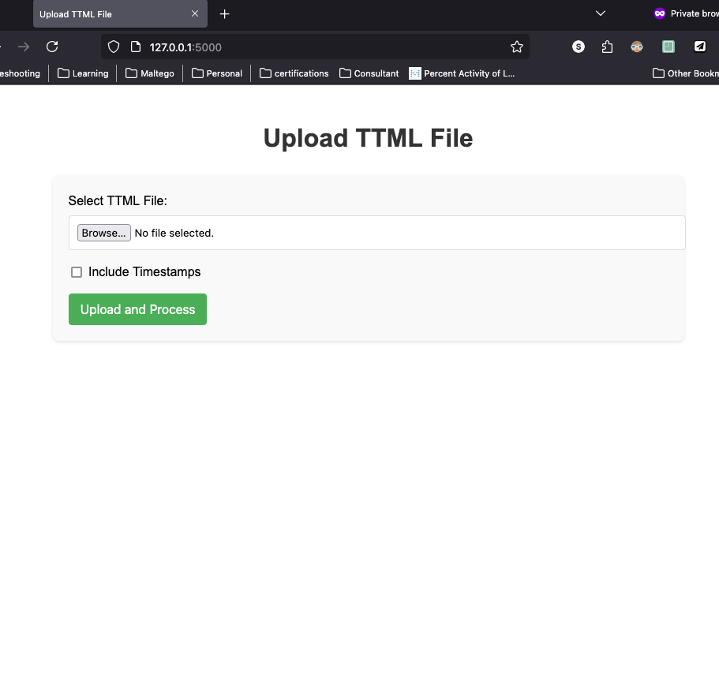
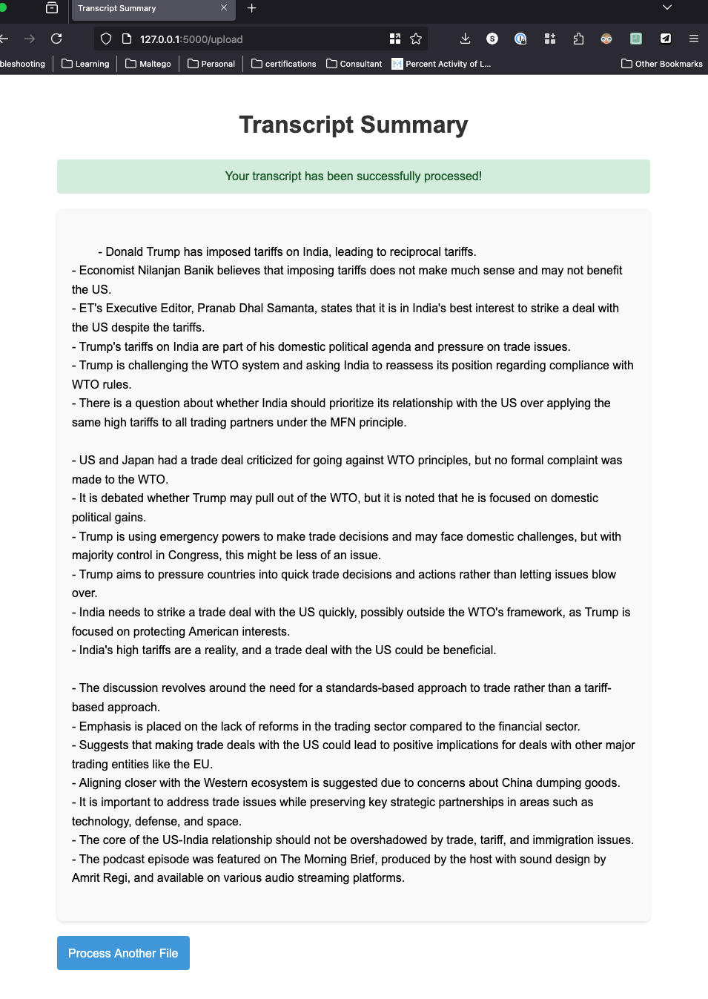

# Podcast Transcript Extractor and Summarizer

This is a Flask web application that allows users to upload TTML files, extract transcripts, and summarize them using OpenAI's GPT-4 model.

## Limitations
- Apple Podcasts app running on an Apple Desktop/Macbook
- Manually download the specific podcast episode

## Installation

1. Clone the repository:
    ```sh
    git clone https://github.com/saikamat/podcast-transcript-extractor.git
    cd apple-podcast-transcript-extractor
    ```

2. Create a virtual environment and activate it:
    ```sh
    python3 -m venv venv
    source venv/bin/activate
    ```

3. Install the required packages:
    ```sh
    pip install -r requirements.txt
    ```

4. Create a `.env` file in the root directory and add your OpenAI API key:
    ```plaintext
    OPENAI_API_KEY=your_openai_api_key
    ```

## Running the Application

1. Start the application:
    ```sh
    bash run.sh # for Linux/Mac OS
    run.bat # for Windows
    ```
2. Open your web browser and go to `http://127.0.0.1:5000/`.
3. Upload a TTML file from the `uploads` folder.

1. The application will extract the transcript, summarize it, and display the summary.

## Architecture Diagram


## File Structure
```
podcast-transcript-extractor/
├── app.py
├── requirements.txt
├── .env
├── templates/
│   ├── index.html
│   └── result.html
└── uploads/
```

## Endpoints
- **GET** /: Renders the upload form.
- **POST /upload**: Handles the file upload, extracts the transcript, summarizes it, and displays the summary.
## Dependencies
flask
openAI
python-dotenv
watchdog
werkzeug
## License
This project is licensed under the MIT License.